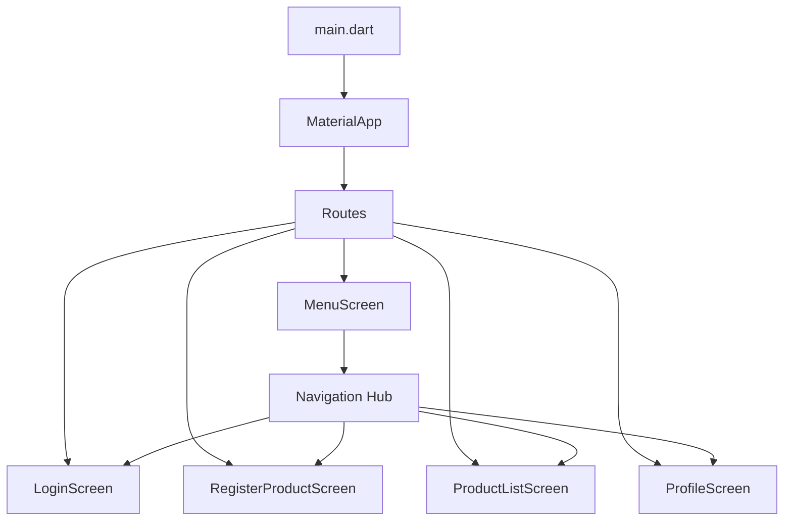
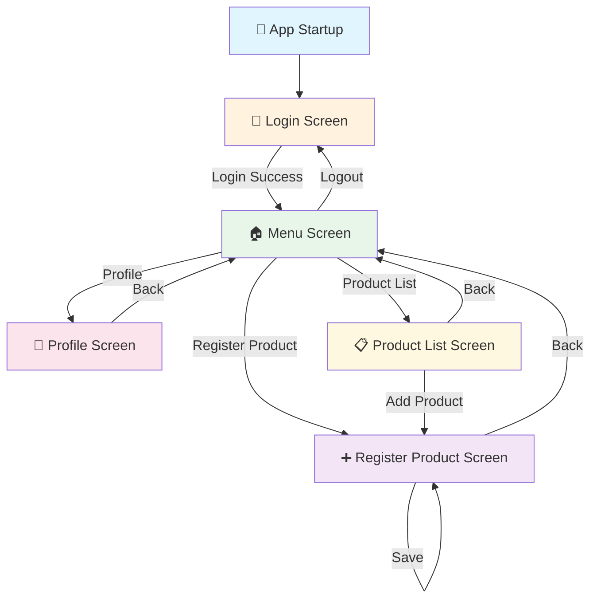
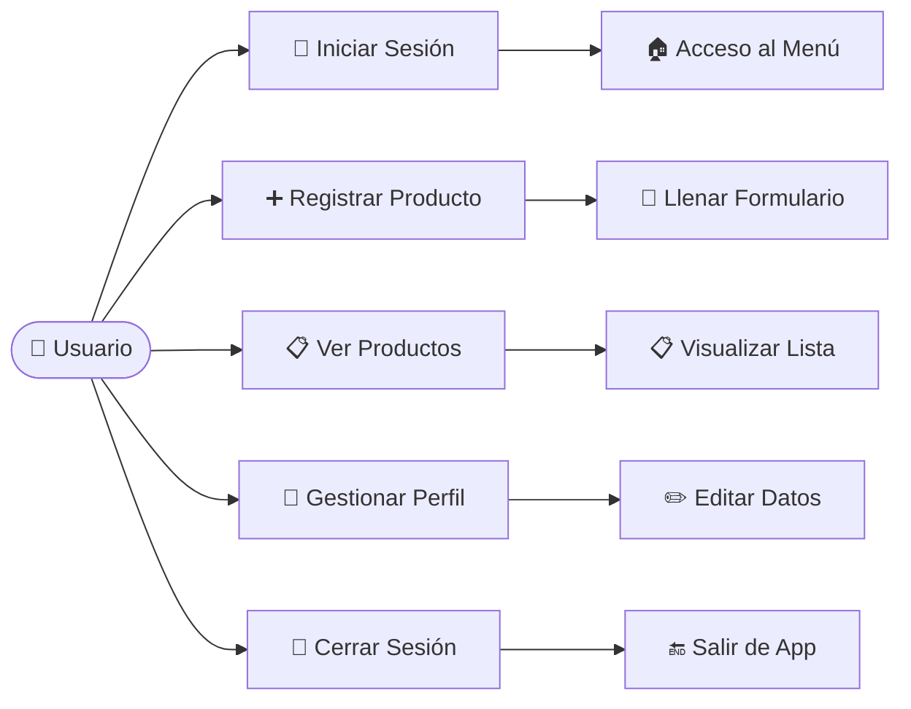

# 🛍️ Tienda Móvil - Aplicación Flutter

<div align="center">
  
  
  
  
</div>

## 📋 Tabla de Contenidos
- [Descripción](#-descripción)
  - [Objetivo](#-objetivo)
  - [Usuario Actual](#-usuario-actual)
- [Características](#-características)
- [Arquitectura](#-arquitectura)
- [Estructura del Proyecto](#-estructura-del-proyecto)
- [Instalación y Configuración](#-instalación-y-configuración)
- [Ejecución](#-ejecución)
- [Pantallas y Funcionalidades](#-pantallas-y-funcionalidades)
- [Flujo de Navegación](#-flujo-de-navegación)
- [Casos de Uso](#-casos-de-uso)
- [Tecnologías](#-tecnologías)
- [Datos de Prueba](#-datos-de-prueba)
- [Roadmap](#-roadmap)
- [Contribución](#-contribución)
- [Licencia](#-licencia)

## 📱 Descripción

**Tienda Móvil** es una aplicación Flutter moderna y elegante diseñada para la gestión de productos y usuarios. La aplicación cuenta con un sistema de navegación intuitivo que permite a los usuarios registrar productos, visualizar inventarios y gestionar su perfil personal.

### 🎯 Objetivo
Crear una plataforma móvil eficiente para pequeños comercios que necesiten gestionar su inventario de productos de manera sencilla y profesional.

### 👤 Usuario Actual

| Dato | Valor |
|------|-------|
| **Nombre Completo** | Rafael Chucco |
| **Fecha de Nacimiento** | 19 de agosto de 2006 |
| **Email** | rafael@gmail.com |
| **Miembro Desde** | Febrero 2023 |
| **Estado** | Activo |


## ✨ Características

### 🔐 Autenticación
- ✅ Pantalla de login con validación visual
- ✅ Función logout implementada
- 🔄 Navegación automática entre sesiones

### 📦 Gestión de Productos  
- ✅ Registro de productos con 5 campos completos
- ✅ Lista interactiva de productos (ListView)
- ✅ Navegación fluida entre pantallas
- 🔄 Integración con formularios

### 👤 Perfil de Usuario
- ✅ Gestión completa de datos personales
- ✅ Selector de fecha de nacimiento
- ✅ Información de cuenta integrada

### 🧭 Navegación
- ✅ Menú principal centralizado
- ✅ Navegación por rutas nombradas
- ✅ Transiciones suaves entre pantallas

## 🏗️ Arquitectura

La aplicación sigue una arquitectura **MVC (Model-View-Controller)** simplificada con enfoque en **Stateful Widgets** para el manejo de estado local.



### 🎨 Patrón de Diseño
- **Separation of Concerns**: Cada pantalla en archivo separado
- **Stateful Widgets**: Para manejo de formularios y estado
- **Material Design 3**: Siguiendo las últimas guías de Google
- **Responsive Layout**: Adaptable a diferentes tamaños

## 📁 Estructura del Proyecto

```
tiendamovil/
├── 📄 README.md                     # Documentación principal
├── 📄 pubspec.yaml                  # Dependencias y configuración
├── 📁 lib/                          # Código fuente principal
│   ├── 📄 main.dart                 # Punto de entrada y rutas
│   └── 📁 screens/                  # Pantallas de la aplicación
│       ├── 📄 login_screen.dart             # 🔐 Pantalla de login
│       ├── 📄 menu_screen.dart              # 🏠 Menú principal
│       ├── 📄 register_product_screen.dart  # ➕ Registro de productos
│       ├── 📄 product_list_screen.dart      # 📋 Lista de productos
│       └── 📄 profile_screen.dart           # 👤 Perfil de usuario
├── 📁 android/                      # Configuración Android
├── 📁 ios/                          # Configuración iOS
├── 📁 web/                          # Configuración Web
├── 📁 windows/                      # Configuración Windows
├── 📁 macos/                        # Configuración macOS
└── 📁 test/                         # Tests unitarios
```

## 🛠️ Instalación y Configuración

### Prerequisitos
Antes de comenzar, asegúrate de tener instalado:

- **Flutter SDK** (versión 3.11.4 o superior)
- **Dart SDK** (incluido con Flutter)
- **Android Studio** o **Visual Studio Code**
- **Git** para control de versiones

### 📋 Verificación del Entorno

```bash
# Verificar instalación de Flutter
flutter doctor

# Verificar versión de Flutter
flutter --version
```

### 🚀 Instalación

1. **Clona el repositorio**
```bash
git clone https://github.com/tuusuario/tiendamovil.git
cd tiendamovil
```

2. **Instala las dependencias**
```bash
flutter pub get
```

3. **Verifica la configuración**
```bash
flutter doctor -v
```

4. **Conecta tu dispositivo o inicia un emulador**
```bash
# Ver dispositivos disponibles
flutter devices
```

## 🚀 Ejecución

### 📱 Ejecutar en Dispositivo/Emulador

```bash
# Ejecución básica
flutter run

# Ejecución en modo debug con hot reload
flutter run --debug

# Ejecución en modo release (optimizado)
flutter run --release

# Ejecución en dispositivo específico
flutter run -d <device_id>
```

### 🔧 Comandos de Desarrollo

```bash
# Hot reload (durante ejecución)
r

# Hot restart (durante ejecución)  
R

# Abrir DevTools
flutter inspector

# Analizar rendimiento
flutter run --profile
```

### 🌐 Plataformas Soportadas

- ✅ **Android** (API 21+)
- ✅ **iOS** (iOS 12+)
- ✅ **Web** (Chrome, Firefox, Safari)
- ✅ **Windows** (Windows 10+)
- ✅ **macOS** (macOS 10.14+)
- ✅ **Linux** (Ubuntu 18.04+)

## 📱 Pantallas y Funcionalidades

### 🔐 1. Login Screen (`login_screen.dart`)

<div align="center">

| Campo | Tipo | Validación | Descripción |
|-------|------|-----------|-------------|
| **Email** | TextEditingController | Visual | Campo de correo electrónico |
| **Password** | TextEditingController | Oculto | Campo de contraseña |
| **LOGIN Button** | ElevatedButton | - | Navega al menú principal |

</div>

**Funcionalidades:**
- ✅ Campos de entrada con diseño Material
- ✅ Navegación automática al menú tras login
- ✅ Interfaz responsive y elegante
- ✅ Validación visual de campos

**Flujo:**
```
Usuario ingresa credenciales → Presiona LOGIN → Navega a MenuScreen
```

---

### 🏠 2. Menu Screen (`menu_screen.dart`)

<div align="center">

| Opción | Acción | Navegación | Descripción |
|--------|--------|-----------|-------------|
| **Home** | Mensaje informativo | Local | Pantalla principal (futura) |
| **Profile** | Navigator.pushNamed | `/profile` | Ir a perfil de usuario |
| **Registrar Producto** | Navigator.pushNamed | `/register-product` | Ir a registro |
| **Lista de Productos** | Navigator.pushNamed | `/product-list` | Ver inventario |
| **Settings** | Mensaje informativo | Local | Configuraciones (futura) |
| **Logout** | Función flecha | `/login` | Cerrar sesión |

</div>

**Funcionalidades:**
- ✅ Hub central de navegación
- ✅ Función logout implementada como arrow function
- ✅ Diseño de menú modular y escalable
- ✅ Feedback visual para cada acción

**Código de Logout:**
```dart
void _logout(BuildContext context) {
  // Función flecha para logout
  Navigator.pushReplacementNamed(context, '/login');
}
```

---

### ➕ 3. Register Product Screen (`register_product_screen.dart`)

<div align="center">

| # | Campo | Tipo | Keyboard | Validación | Descripción |
|---|-------|------|----------|-----------|-------------|
| 1️⃣ | **Nombre del producto** | TextEditingController | text | Requerido | Nombre identificativo |
| 2️⃣ | **Precio** | TextEditingController | number | Numérico | Precio en moneda local |
| 3️⃣ | **Descripción** | TextEditingController | text | Opcional | Descripción detallada (3 líneas) |
| 4️⃣ | **Categoría** | TextEditingController | text | Requerido | Clasificación del producto |
| 5️⃣ | **Stock** | TextEditingController | number | Numérico | Cantidad en inventario |

</div>

**Funcionalidades:**
- ✅ Formulario completo con 5 campos específicos
- ✅ Validación de tipos de entrada
- ✅ Botón GUARDAR con feedback
- ✅ Auto-limpieza de campos tras guardar
- ✅ Scroll automático para pantallas pequeñas

**Flujo del Formulario:**
```
Llenar campos → GUARDAR → Mostrar confirmación → Limpiar formulario
```

---

### 📋 4. Product List Screen (`product_list_screen.dart`)

<div align="center">

| Elemento | Tipo | Datos Mostrados | Interacción |
|----------|------|----------------|-------------|
| **Header** | Text | "Items" | Visual |
| **Product Item** | Custom Widget | Nombre, Precio, Descripción, Categoría | Tap para seleccionar |
| **FAB** | FloatingActionButton | Icono + | Navega a registro |
| **ListView** | ListView.builder | Lista dinámica | Scroll infinito |

</div>

**Estructura de Producto:**
```dart
Map<String, String> product = {
  'name': 'Nombre del producto',
  'price': 'Precio formateado',
  'description': 'Descripción completa',
  'category': 'Categoría del producto',
};
```

**Funcionalidades:**
- ✅ ListView optimizado con builder pattern
- ✅ Diseño de cards elegante y responsive
- ✅ Navegación directa al formulario de registro
- ✅ Feedback visual al seleccionar productos
- ✅ Datos de ejemplo pre-cargados

---

### 👤 5. Profile Screen (`profile_screen.dart`)

<div align="center">

| Sección | Campo | Tipo | Widget | Valor Actual | Funcionalidad |
|---------|-------|------|--------|--------------|---------------|
| **Avatar** | Foto de perfil | CircleAvatar | Icon | 👤 | Placeholder visual |
| **Datos Personales** | Nombre | TextEditingController | TextField | **Rafael** | Editable |
| **Datos Personales** | Apellidos | TextEditingController | TextField | **Chucco** | Editable |
| **Datos Personales** | Fecha de nacimiento | TextEditingController | DatePicker | **19/08/2006** | Selector de fecha |
| **Información** | Email | Text (readonly) | Container | **rafael@gmail.com** | Solo lectura |
| **Información** | Miembro desde | Text (readonly) | Container | **Febrero 2023** | Solo lectura |
| **Información** | Productos registrados | Text (readonly) | Container | 12 | Contador |

</div>

**Funcionalidades Especiales:**
- ✅ **Selector de fecha interactivo** con fecha de nacimiento del usuario (19/08/2006)
- ✅ **Avatar placeholder personalizable**
- ✅ **Información de cuenta integrada** con datos personales reales
- ✅ **Formulario de edición completo** para gestionar datos del usuario
- ✅ **Validación de fechas** dentro del rango permitido (1900 hasta hoy)

**DatePicker Implementation (Usuario Rafael Chucco):**
```dart
Future<void> _selectBirthDate(BuildContext context) async {
  final DateTime? picked = await showDatePicker(
    context: context,
    initialDate: DateTime(2006, 8, 19),  // Fecha de Rafael
    firstDate: DateTime(1900),
    lastDate: DateTime.now(),
  );
  // Formateo automático DD/MM/AAAA
  // Ej: 19/08/2006
}
```

**Datos de Prueba Pre-cargados:**
```dart
void initState() {
  super.initState();
  // Usuario: Rafael Chucco
  _firstNameController.text = 'Rafael';
  _lastNameController.text = 'Chucco';
  _birthDateController.text = '19/08/2006';
  
  // Información de cuenta
  // Email: rafael@gmail.com
  // Miembro desde: Febrero 2023
}
```

## 🧭 Flujo de Navegación



### 📍 Rutas Definidas

| Ruta | Pantalla | Descripción |
|------|----------|-------------|
| `/login` | LoginScreen | Pantalla inicial de autenticación |
| `/menu` | MenuScreen | Hub central de navegación |
| `/register-product` | RegisterProductScreen | Formulario de registro |
| `/product-list` | ProductListScreen | Lista de productos |
| `/profile` | ProfileScreen | Perfil de usuario |

## 🎯 Casos de Uso

### 👤 Actor: Usuario de la Tienda



### 📋 Casos de Uso Detallados

1. **CU-001: Autenticación de Usuario**
   - **Precondición**: Usuario tiene credenciales
   - **Flujo**: Login → Validación → Acceso al menú
   - **Postcondición**: Usuario autenticado en el sistema

2. **CU-002: Registro de Producto**
   - **Precondición**: Usuario autenticado
   - **Flujo**: Menú → Formulario → Llenar 5 campos → Guardar
   - **Postcondición**: Producto registrado en el sistema

3. **CU-003: Visualización de Productos**
   - **Precondición**: Productos existentes en el sistema
   - **Flujo**: Menú → Lista → Ver detalles
   - **Postcondición**: Usuario visualiza inventario

4. **CU-004: Gestión de Perfil**
   - **Precondición**: Usuario autenticado
   - **Flujo**: Menú → Perfil → Editar → Guardar
   - **Postcondición**: Datos actualizados

## 💻 Tecnologías

### 🎨 Frontend
- **Framework**: Flutter 3.11.4+
- **Lenguaje**: Dart
- **UI Kit**: Material Design 3
- **Navegación**: Named Routes
- **Estado**: StatefulWidget

### 📦 Dependencias Principales
```yaml
dependencies:
  flutter:
    sdk: flutter
  cupertino_icons: ^1.0.8

dev_dependencies:
  flutter_test:
    sdk: flutter
  flutter_lints: ^6.0.0
```

### 🎨 Paleta de Colores
- **Primario**: `#4285F4` (Google Blue)
- **Secundario**: `#FFFFFF` (White)
- **Accent**: `#E3F2FD` (Light Blue)
- **Error**: `#F44336` (Red)
- **Success**: `#4CAF50` (Green)

## 🧪 Datos de Prueba

### 👤 Usuario Principal: Rafael Chucco

Para probar la aplicación, se incluyen los siguientes datos pre-cargados:

#### Información Personal
| Campo | Valor |
|-------|-------|
| **Nombre** | Rafael |
| **Apellidos** | Chucco |
| **Fecha de Nacimiento** | 19/08/2006 (19 de agosto de 2006) |
| **Edad** | 19 años |

#### Información de Cuenta
| Campo | Valor |
|-------|-------|
| **Email** | rafael@gmail.com |
| **Miembro desde** | Febrero 2023 |
| **Productos Registrados** | 12 |
| **Estado** | Activo |

#### Acceso a la Aplicación
| Campo | Valor (Ej) |
|-------|-------|
| **Email de Login** | (Usar cualquier valor) |
| **Contraseña** | (Usar cualquier valor) |

**Nota**: Actualmente la aplicación no valida credenciales. El login redirige directamente al menú para fines de desarrollo.

### 📦 Productos de Ejemplo

En la pantalla de "Lista de Productos" encontrarás productos de ejemplo con la siguiente estructura:

```dart
{
  'name': 'Nombre del Producto',
  'price': 'Precio en moneda local',
  'description': 'Descripción del producto',
  'category': 'Categoría (Ej: Electrónica, Ropa, etc)',
}
```

**Total de productos de ejemplo**: 12 unidades

## 🗺️ Roadmap

### 📅 Versión 1.1.0 (Próxima)
- [ ] **Implementación de Base de Datos**
  - [ ] SQLite local para productos
  - [ ] Persistencia de datos de usuario
  - [ ] Sincronización offline

- [ ] **Autenticación Real**
  - [ ] Validación de credenciales
  - [ ] Registro de nuevos usuarios
  - [ ] Recuperación de contraseña

### 📅 Versión 1.2.0 (Futura)
- [ ] **Funcionalidades Avanzadas**
  - [ ] Búsqueda y filtros de productos
  - [ ] Categorías dinámicas
  - [ ] Imágenes de productos
  - [ ] Reportes y estadísticas

- [ ] **Mejoras de UX**
  - [ ] Animaciones y transiciones
  - [ ] Tema oscuro/claro
  - [ ] Notificaciones push
  - [ ] Internacionalización (i18n)

### 📅 Versión 2.0.0 (Visión)
- [ ] **Backend Integration**
  - [ ] API REST
  - [ ] Sincronización en la nube
  - [ ] Multi-usuario
  - [ ] Dashboard web administrativo

## 🤝 Contribución

¡Las contribuciones son bienvenidas! Sigue estos pasos:

### 🛠️ Configuración para Desarrollo

1. **Fork el proyecto**
2. **Crear rama de feature**
```bash
git checkout -b feature/nueva-funcionalidad
```

3. **Commit de cambios**
```bash
git commit -m 'Add: nueva funcionalidad increíble'
```

4. **Push a la rama**
```bash
git push origin feature/nueva-funcionalidad
```

5. **Abrir Pull Request**

### 📝 Estándares de Código
- **Dart Style Guide**: Seguir convenciones oficiales
- **Comentarios**: Documentar funciones complejas
- **Testing**: Incluir tests para nuevas funcionalidades
- **Commits**: Usar conventional commits

## 📄 Licencia

Este proyecto está bajo la Licencia MIT - ver el archivo [LICENSE](LICENSE) para más detalles.

---

<div align="center">

### 🚀 ¿Listo para comenzar?

```bash
flutter run
```

**Desarrollado con ❤️ usando Flutter**

[🐛 Reportar Bug](https://github.com/tuusuario/tiendamovil/issues) | [💡 Solicitar Feature](https://github.com/tuusuario/tiendamovil/issues) | [📖 Documentación](https://github.com/tuusuario/tiendamovil/wiki)

</div>

---

**📅 Última actualización**: Mayo 2026  
**👨‍💻 Autor**: Tu Nombre  
**📧 Contacto**: tuemail@ejemplo.com