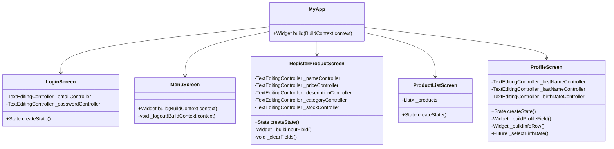

# 🔌 API Reference - Tienda Móvil

## 📋 Tabla de Contenidos
- [Descripción General](#-descripción-general)
- [Arquitectura Actual](#-arquitectura-actual)
- [Widgets y Componentes](#-widgets-y-componentes)
- [Modelos de Datos](#-modelos-de-datos)
- [Servicios y Utilidades](#-servicios-y-utilidades)
- [Navegación](#-navegación)
- [API Futura](#-api-futura)
- [Ejemplos de Uso](#-ejemplos-de-uso)

## 🎯 Descripción General

Esta documentación describe la **API interna** de la aplicación Tienda Móvil, incluyendo todos los widgets, clases, métodos y estructuras de datos disponibles para desarrollo.

> **Nota**: La aplicación actualmente (v1.0.0) no consume APIs externas. Esta documentación cubre la estructura interna del código Flutter.

## 🏗️ Arquitectura Actual

### Jerarquía de Clases



## 🧩 Widgets y Componentes

### 🚀 MyApp (Root Widget)

**Ubicación**: `lib/main.dart`

```dart
class MyApp extends StatelessWidget {
  const MyApp({super.key});
  
  @override
  Widget build(BuildContext context) {
    return CupertinoApp(
      title: 'Tienda Móvil',
      debugShowCheckedModeBanner: false,
      theme: const CupertinoThemeData(
        primaryColor: CupertinoColors.systemBlue,
      ),
      initialRoute: '/login',
      routes: {
        '/login': (context) => const LoginScreen(),
        '/main': (context) => const MainTabScaffold(),
      },
    );
  }
}
```

#### Propiedades:
| Propiedad | Tipo | Descripción |
|-----------|------|-------------|
| `title` | String | Título de la aplicación |
| `theme` | CupertinoThemeData | Tema Cupertino con `primaryColor` |
| `initialRoute` | String | Ruta inicial (`/login`) |
| `routes` | Map<String, WidgetBuilder> | Mapa de rutas nombradas |

---

### 🔐 LoginScreen

**Ubicación**: `lib/screens/login_screen.dart`

```dart
class LoginScreen extends StatefulWidget {
  const LoginScreen({super.key});

  @override
  State<LoginScreen> createState() => _LoginScreenState();
}

class _LoginScreenState extends State<LoginScreen> {
  final TextEditingController _emailController = TextEditingController();
  final TextEditingController _passwordController = TextEditingController();
  
  // ... implementación
}
```

#### Propiedades Privadas:
| Propiedad | Tipo | Descripción |
|-----------|------|-------------|
| `_emailController` | TextEditingController | Controlador del campo email |
| `_passwordController` | TextEditingController | Controlador del campo password |

#### Métodos Públicos:
| Método | Retorno | Descripción |
|--------|---------|-------------|
| `build(BuildContext context)` | Widget | Construye la UI de login |
| `dispose()` | void | Libera recursos de controladores |

#### Eventos:
- **onPressed (LOGIN)**: Navega a `/main` usando `Navigator.pushReplacementNamed`

---

### 🏠 MainTabScaffold

**Ubicación**: `lib/screens/main_tab_scaffold.dart`

```dart
class MainTabScaffold extends StatelessWidget {
  const MainTabScaffold({super.key});
  
  @override
  Widget build(BuildContext context) {
    return CupertinoTabScaffold(
      tabBar: CupertinoTabBar(
        activeColor: CupertinoColors.systemBlue,
        items: const [
          BottomNavigationBarItem(icon: Icon(CupertinoIcons.house_fill), label: 'Home'),
          BottomNavigationBarItem(icon: Icon(CupertinoIcons.cube_box_fill), label: 'Productos'),
          BottomNavigationBarItem(icon: Icon(CupertinoIcons.person_fill), label: 'Perfil'),
          BottomNavigationBarItem(icon: Icon(CupertinoIcons.settings_solid), label: 'Ajustes'),
        ],
      ),
      tabBuilder: (context, index) {
        // Retorna CupertinoTabView según el índice
      },
    );
  }
}
```

**Propiedades del CupertinoTabBar**:
| Propiedad | Tipo | Descripción |
|-----------|------|-------------|
| `activeColor` | CupertinoColors | Color del tab activo |
| `items` | List<BottomNavigationBarItem> | Tabs con ícono y label |

---

### ➕ RegisterProductScreen

**Ubicación**: `lib/screens/register_product_screen.dart`

```dart
class RegisterProductScreen extends StatefulWidget {
  const RegisterProductScreen({super.key});
}

class _RegisterProductScreenState extends State<RegisterProductScreen> {
  final TextEditingController _nameController = TextEditingController();
  final TextEditingController _priceController = TextEditingController();
  final TextEditingController _descriptionController = TextEditingController();
  final TextEditingController _categoryController = TextEditingController();
  final TextEditingController _stockController = TextEditingController();
}
```

#### Controladores de Campos:
| Controlador | Campo | Tipo de Teclado | Validación |
|-------------|-------|-----------------|------------|
| `_nameController` | Nombre del producto | text | Requerido |
| `_priceController` | Precio | number | Numérico |
| `_descriptionController` | Descripción | text | Opcional |
| `_categoryController` | Categoría | text | Requerido |
| `_stockController` | Stock | number | Numérico |

#### Métodos Privados:
```dart
Widget _buildInputField(
  String label,
  TextEditingController controller,
  String hint, {
  TextInputType keyboardType = TextInputType.text,
  int maxLines = 1,
})

void _clearFields()
```

| Método | Parámetros | Descripción |
|--------|------------|-------------|
| `_buildInputField` | label, controller, hint, keyboardType, maxLines | Construye campo de entrada personalizado |
| `_clearFields` | - | Limpia todos los controladores |

---

### 📋 ProductListScreen

**Ubicación**: `lib/screens/product_list_screen.dart`

```dart
class ProductListScreen extends StatefulWidget {
  const ProductListScreen({super.key});
}

class _ProductListScreenState extends State<ProductListScreen> {
  final List<Map<String, String>> _products = [
    {
      'name': 'Producto 1',
      'price': '\$25.99',
      'description': 'Descripción del producto 1',
      'category': 'Categoría A',
    },
    // ... más productos
  ];
}
```

#### Estructura de Datos de Producto:
```dart
Map<String, String> product = {
  'name': String,        // Nombre del producto
  'price': String,       // Precio formateado con moneda
  'description': String, // Descripción completa
  'category': String,    // Categoría del producto
};
```

#### Widget Personalizado: _ProductItem

```dart
class _ProductItem extends StatelessWidget {
  final String name;
  final String price;
  final String description;
  final String category;
  final VoidCallback onTap;
}
```

**Propiedades**:
| Propiedad | Tipo | Descripción |
|-----------|------|-------------|
| `name` | String | Nombre del producto |
| `price` | String | Precio formateado |
| `description` | String | Descripción del producto |
| `category` | String | Categoría del producto |
| `onTap` | VoidCallback | Acción al tocar el item |

---

### 👤 ProfileScreen

**Ubicación**: `lib/screens/profile_screen.dart`

```dart
class ProfileScreen extends StatefulWidget {
  const ProfileScreen({super.key});
}

class _ProfileScreenState extends State<ProfileScreen> {
  final TextEditingController _firstNameController = TextEditingController();
  final TextEditingController _lastNameController = TextEditingController();
  final TextEditingController _birthDateController = TextEditingController();
}
```

#### Métodos Privados:

```dart
Widget _buildProfileField(
  String label,
  TextEditingController controller,
  String hint, {
  bool readOnly = false,
  VoidCallback? onTap,
})

Widget _buildInfoRow(String label, String value)

Future<void> _selectBirthDate(BuildContext context)
```

| Método | Parámetros | Retorno | Descripción |
|--------|------------|---------|-------------|
| `_buildProfileField` | label, controller, hint, readOnly, onTap | Widget | Campo de perfil personalizado |
| `_buildInfoRow` | label, value | Widget | Fila de información de solo lectura |
| `_selectBirthDate` | context | Future<void> | Abre selector de fecha |

#### DatePicker Configuration (CupertinoDatePicker):
```dart
void _selectBirthDate(BuildContext context) {
  showCupertinoModalPopup<void>(
    context: context,
    builder: (ctx) => SizedBox(
      height: 260,
      child: CupertinoDatePicker(
        mode: CupertinoDatePickerMode.date,
        initialDateTime: DateTime(2006, 8, 19),
        minimumDate: DateTime(1900),
        maximumDate: DateTime.now(),
        onDateTimeChanged: (date) { /* actualizar controlador */ },
      ),
    ),
  );
}
```

## 📊 Modelos de Datos

### 🏷️ Producto (Estructura Actual)

```dart
// Estructura temporal (Map)
Map<String, String> product = {
  'name': 'Nombre del producto',
  'price': 'Precio formateado (\$99.99)',
  'description': 'Descripción detallada',
  'category': 'Categoría del producto',
};
```

### 👤 Usuario (Estructura Actual)

```dart
// Datos hardcodeados en ProfileScreen
Map<String, String> userInfo = {
  'firstName': 'Juan',
  'lastName': 'Pérez',
  'birthDate': '15/03/1990',
  'email': 'usuario@ejemplo.com',
  'memberSince': 'Enero 2024',
  'productsCount': '12',
};
```

### 🚀 Modelos Futuros (v1.1.0+)

#### Clase User:
```dart
class User {
  final String id;
  final String firstName;
  final String lastName;
  final DateTime birthDate;
  final String email;
  final DateTime memberSince;
  final String? profileImage;
  
  User({
    required this.id,
    required this.firstName,
    required this.lastName,
    required this.birthDate,
    required this.email,
    required this.memberSince,
    this.profileImage,
  });
  
  // Serialization methods
  Map<String, dynamic> toJson() => { /*...*/ };
  factory User.fromJson(Map<String, dynamic> json) => User(/*...*/);
}
```

#### Clase Product:
```dart
class Product {
  final String id;
  final String name;
  final double price;
  final String description;
  final String category;
  final int stock;
  final DateTime createdAt;
  final DateTime updatedAt;
  final String? imageUrl;
  
  Product({
    required this.id,
    required this.name,
    required this.price,
    required this.description,
    required this.category,
    required this.stock,
    required this.createdAt,
    required this.updatedAt,
    this.imageUrl,
  });
  
  // Methods
  bool get isInStock => stock > 0;
  String get formattedPrice => '\$${price.toStringAsFixed(2)}';
  
  // Serialization
  Map<String, dynamic> toJson() => { /*...*/ };
  factory Product.fromJson(Map<String, dynamic> json) => Product(/*...*/);
}
```

#### Clase Category:
```dart
class Category {
  final String id;
  final String name;
  final String description;
  final IconData icon;
  final Color color;
  
  Category({
    required this.id,
    required this.name,
    required this.description,
    required this.icon,
    required this.color,
  });
}
```

## 🔧 Servicios y Utilidades

### 🎨 Constantes de Tema (CupertinoColors actuales)

```dart
// Colores semánticos Cupertino ya en uso
CupertinoColors.systemBlue        // Primario / acciones
CupertinoColors.systemBackground  // Fondo principal
CupertinoColors.label             // Texto principal
CupertinoColors.secondaryLabel    // Texto secundario
CupertinoColors.tertiaryLabel     // Texto terciario
CupertinoColors.systemGrey6       // Superficie / cards
CupertinoColors.separator         // Separadores
CupertinoColors.systemRed         // Acciones destructivas
CupertinoColors.systemIndigo      // Acentos alternativos
CupertinoColors.white             // Texto sobre fondos oscuros

// colors.dart (futuro - wrapper de CupertinoColors)
class AppColors {
  static const primary = CupertinoColors.systemBlue;
  static const background = CupertinoColors.systemBackground;
  static const label = CupertinoColors.label;
  static const secondaryLabel = CupertinoColors.secondaryLabel;
}
```

### 📏 Constantes de Dimensiones

```dart
// dimensions.dart (futuro)
class AppDimensions {
  // Padding
  static const double paddingSmall = 8.0;
  static const double paddingMedium = 16.0;
  static const double paddingLarge = 24.0;
  static const double paddingXLarge = 32.0;
  
  // Border radius
  static const double radiusSmall = 4.0;
  static const double radiusMedium = 8.0;
  static const double radiusLarge = 16.0;
  
  // Button heights
  static const double buttonHeight = 50.0;
  static const double buttonHeightSmall = 36.0;
  
  // Icon sizes
  static const double iconSmall = 16.0;
  static const double iconMedium = 24.0;
  static const double iconLarge = 32.0;
}
```

### ✅ Validadores (Futuro)

```dart
// validators.dart (futuro)
class Validators {
  static String? validateEmail(String? value) {
    if (value == null || value.isEmpty) {
      return 'El email es requerido';
    }
    if (!RegExp(r'^[\w-\.]+@([\w-]+\.)+[\w-]{2,4}$').hasMatch(value)) {
      return 'Ingresa un email válido';
    }
    return null;
  }
  
  static String? validatePrice(String? value) {
    if (value == null || value.isEmpty) {
      return 'El precio es requerido';
    }
    if (double.tryParse(value) == null || double.parse(value) <= 0) {
      return 'Ingresa un precio válido';
    }
    return null;
  }
  
  static String? validateStock(String? value) {
    if (value == null || value.isEmpty) {
      return 'El stock es requerido';
    }
    if (int.tryParse(value) == null || int.parse(value) < 0) {
      return 'Ingresa un stock válido';
    }
    return null;
  }
  
  static String? validateRequired(String? value, String fieldName) {
    if (value == null || value.isEmpty) {
      return '$fieldName es requerido';
    }
    return null;
  }
}
```

## 🧭 Sistema de Navegación

### 📍 Rutas Definidas

```dart
// routes.dart (futuro)
class AppRoutes {
  static const String login = '/login';
  static const String main = '/main';  // MainTabScaffold con CupertinoTabScaffold
  
  // Navegación intra-tab via CupertinoPageRoute (no rutas nombradas)
  // Tab 0: HomeScreen
  // Tab 1: ProductListScreen -> RegisterProductScreen
  // Tab 2: ProfileScreen
  // Tab 3: SettingsScreen
}
```

### 🔄 Navegación Helper (Futuro)

```dart
// navigation_helper.dart (futuro)
class NavigationHelper {
  static void navigateToLogin(BuildContext context) {
    Navigator.pushReplacementNamed(context, AppRoutes.login);
  }
  
  static void navigateToMenu(BuildContext context) {
    Navigator.pushReplacementNamed(context, AppRoutes.menu);
  }
  
  static void navigateToProductList(BuildContext context) {
    Navigator.pushNamed(context, AppRoutes.productList);
  }
  
  static void navigateToRegisterProduct(BuildContext context) {
    Navigator.pushNamed(context, AppRoutes.registerProduct);
  }
  
  static void navigateToProfile(BuildContext context) {
    Navigator.pushNamed(context, AppRoutes.profile);
  }
  
  static void navigateBack(BuildContext context) {
    Navigator.pop(context);
  }
  
  // Navegación con datos
  static void navigateToProductDetail(
    BuildContext context, 
    Product product
  ) {
    Navigator.pushNamed(
      context, 
      AppRoutes.productDetail,
      arguments: product,
    );
  }
}
```

## 🌐 API Futura (v2.0.0)

### 🔌 REST API Endpoints (Planificado)

#### Autenticación:
```dart
// auth_service.dart (futuro)
class AuthService {
  static const String baseUrl = 'https://api.tiendamovil.com/v1';
  
  // POST /auth/login
  Future<AuthResponse> login(String email, String password) async {
    final response = await http.post(
      Uri.parse('$baseUrl/auth/login'),
      headers: {'Content-Type': 'application/json'},
      body: jsonEncode({
        'email': email,
        'password': password,
      }),
    );
    
    if (response.statusCode == 200) {
      return AuthResponse.fromJson(jsonDecode(response.body));
    } else {
      throw AuthException('Login failed');
    }
  }
  
  // POST /auth/register
  Future<AuthResponse> register(User user) async { /*...*/ }
  
  // POST /auth/logout
  Future<void> logout() async { /*...*/ }
  
  // POST /auth/refresh
  Future<String> refreshToken(String refreshToken) async { /*...*/ }
}
```

#### Productos:
```dart
// product_service.dart (futuro)
class ProductService {
  static const String baseUrl = 'https://api.tiendamovil.com/v1';
  
  // GET /products
  Future<List<Product>> getProducts({
    int page = 1,
    int limit = 20,
    String? category,
    String? search,
  }) async { /*...*/ }
  
  // POST /products
  Future<Product> createProduct(Product product) async { /*...*/ }
  
  // GET /products/{id}
  Future<Product> getProduct(String id) async { /*...*/ }
  
  // PUT /products/{id}
  Future<Product> updateProduct(String id, Product product) async { /*...*/ }
  
  // DELETE /products/{id}
  Future<void> deleteProduct(String id) async { /*...*/ }
  
  // GET /categories
  Future<List<Category>> getCategories() async { /*...*/ }
}
```

#### Usuario:
```dart
// user_service.dart (futuro)
class UserService {
  // GET /user/profile
  Future<User> getProfile() async { /*...*/ }
  
  // PUT /user/profile
  Future<User> updateProfile(User user) async { /*...*/ }
  
  // POST /user/avatar
  Future<String> uploadAvatar(File imageFile) async { /*...*/ }
  
  // GET /user/statistics
  Future<UserStatistics> getStatistics() async { /*...*/ }
}
```

### 📡 WebSocket Events (Futuro)

```dart
// websocket_service.dart (futuro)
class WebSocketService {
  static const String wsUrl = 'wss://api.tiendamovil.com/ws';
  
  // Events
  static const String productCreated = 'product.created';
  static const String productUpdated = 'product.updated';
  static const String productDeleted = 'product.deleted';
  static const String inventoryAlert = 'inventory.alert';
  
  void connect(String token) { /*...*/ }
  void disconnect() { /*...*/ }
  void subscribe(String event, Function(dynamic) callback) { /*...*/ }
  void emit(String event, Map<String, dynamic> data) { /*...*/ }
}
```

## 💡 Ejemplos de Uso

### 🔐 Ejemplo: Autenticación

```dart
// Uso actual (v1.0.0)
CupertinoButton.filled(
  onPressed: () {
    Navigator.pushReplacementNamed(context, '/main');
  },
  child: const Text('LOGIN'),
)

// Uso futuro (v1.1.0+)
ElevatedButton(
  onPressed: () async {
    final authService = AuthService();
    try {
      await authService.login(
        _emailController.text,
        _passwordController.text,
      );
      NavigationHelper.navigateToMenu(context);
    } catch (e) {
      ScaffoldMessenger.of(context).showSnackBar(
        SnackBar(content: Text('Error: ${e.toString()}')),
      );
    }
  },
  child: Text('LOGIN'),
)
```

### ➕ Ejemplo: Registro de Producto

```dart
// Uso actual (v1.0.0)
CupertinoButton.filled(
  onPressed: () {
    showCupertinoDialog<void>(
      context: context,
      builder: (ctx) => CupertinoAlertDialog(
        title: const Text('Éxito'),
        content: const Text('Producto guardado'),
        actions: [
          CupertinoDialogAction(
            onPressed: () => Navigator.pop(ctx),
            child: const Text('OK'),
          ),
        ],
      ),
    );
    _clearFields();
  },
  child: const Text('GUARDAR'),
)

// Uso futuro (v1.1.0+)
ElevatedButton(
  onPressed: () async {
    if (_formKey.currentState!.validate()) {
      final product = Product(
        id: uuid.v4(),
        name: _nameController.text,
        price: double.parse(_priceController.text),
        description: _descriptionController.text,
        category: _categoryController.text,
        stock: int.parse(_stockController.text),
        createdAt: DateTime.now(),
        updatedAt: DateTime.now(),
      );
      
      try {
        await ProductService().createProduct(product);
        ScaffoldMessenger.of(context).showSnackBar(
          SnackBar(content: Text('Producto guardado exitosamente')),
        );
        _clearFields();
      } catch (e) {
        ScaffoldMessenger.of(context).showSnackBar(
          SnackBar(content: Text('Error al guardar: ${e.toString()}')),
        );
      }
    }
  },
  child: Text('GUARDAR'),
)
```

### 📋 Ejemplo: Lista de Productos

```dart
// Uso actual (v1.0.0)
ListView.builder(
  itemCount: _products.length,
  itemBuilder: (context, index) {
    final product = _products[index];
    return _ProductItem(
      name: product['name']!,
      price: product['price']!,
      description: product['description']!,
      category: product['category']!,
      onTap: () {
        ScaffoldMessenger.of(context).showSnackBar(
          SnackBar(content: Text('Seleccionado: ${product['name']}')),
        );
      },
    );
  },
)

// Uso futuro (v1.1.0+)
FutureBuilder<List<Product>>(
  future: ProductService().getProducts(),
  builder: (context, snapshot) {
    if (snapshot.connectionState == ConnectionState.waiting) {
      return Center(child: CircularProgressIndicator());
    }
    
    if (snapshot.hasError) {
      return Center(child: Text('Error: ${snapshot.error}'));
    }
    
    final products = snapshot.data ?? [];
    
    return ListView.builder(
      itemCount: products.length,
      itemBuilder: (context, index) {
        final product = products[index];
        return ProductCard(
          product: product,
          onTap: () {
            NavigationHelper.navigateToProductDetail(context, product);
          },
        );
      },
    );
  },
)
```

---

<div align="center">

### 🔌 API Reference Completa

**Todo lo que necesitas saber sobre el código interno de Tienda Móvil**

*Esta documentación crecerá con cada nueva versión de la aplicación*

[🏠 Volver al README](../README.md) | [🏗️ Ver Arquitectura](ARCHITECTURE.md) | [👤 Guía de Usuario](USER_GUIDE.md)

</div>