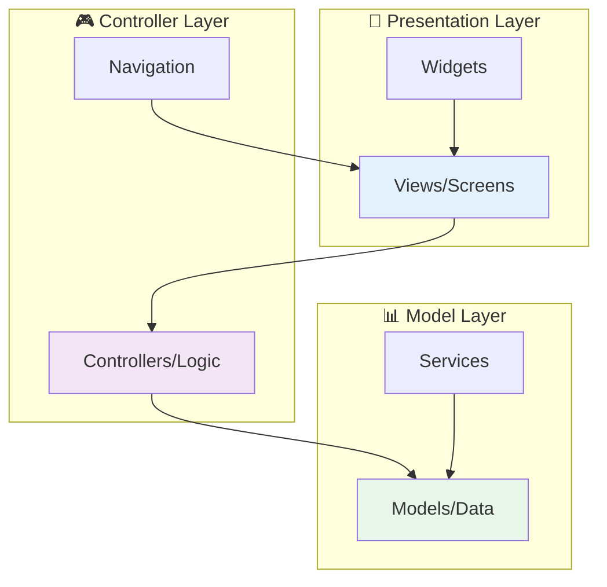
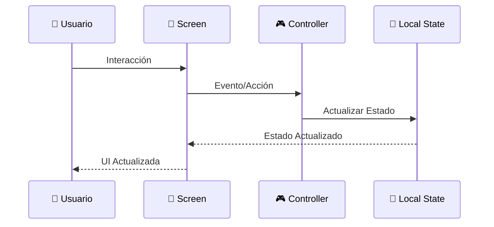
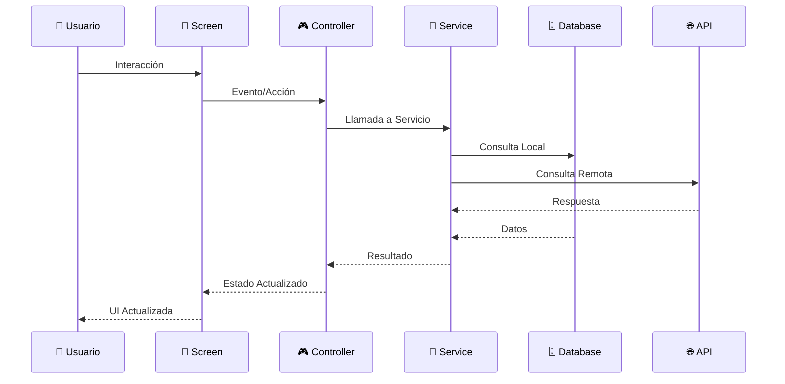
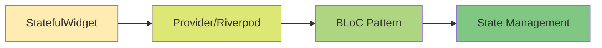
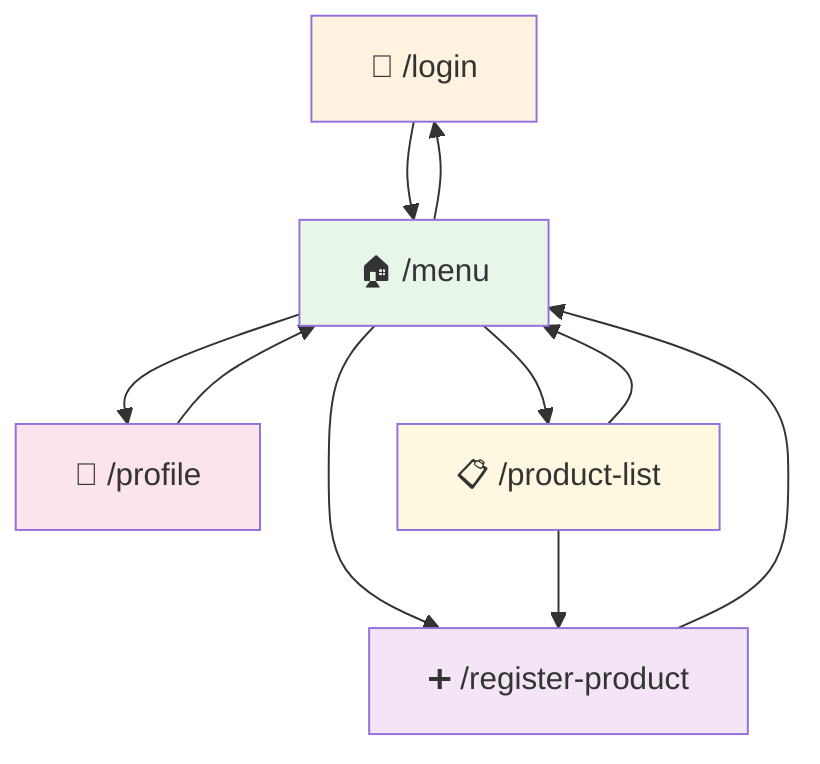
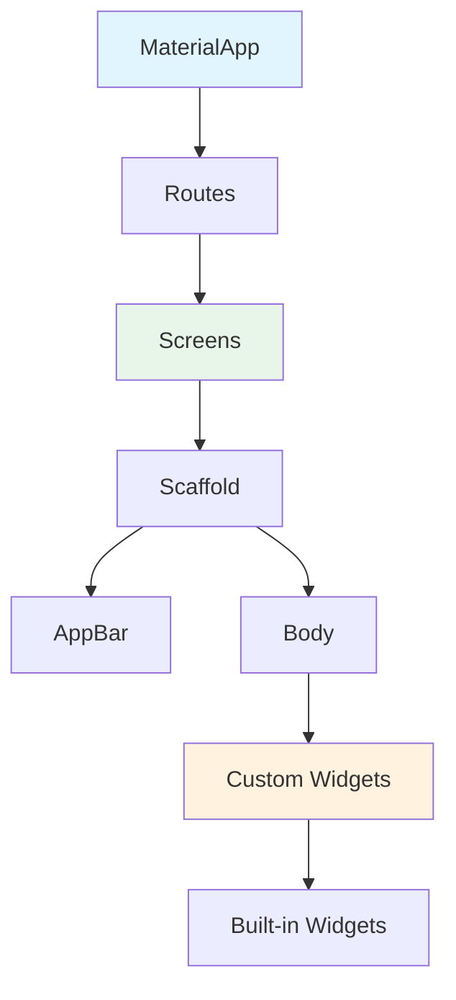
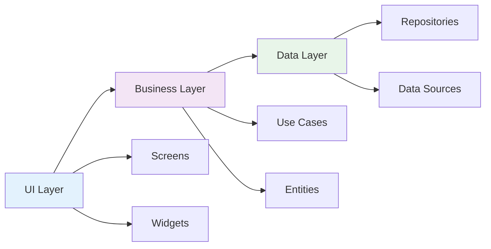

# 🏗️ Arquitectura de la Aplicación Tienda Móvil

## 📋 Tabla de Contenidos
- [Visión General](#-visión-general)
- [Patrón Arquitectónico](#-patrón-arquitectónico)
- [Estructura de Archivos](#-estructura-de-archivos)
- [Flujo de Datos](#-flujo-de-datos)
- [Gestión de Estado](#-gestión-de-estado)
- [Navegación](#-navegación)
- [Componentes](#-componentes)
- [Buenas Prácticas](#-buenas-prácticas)

## 🎯 Visión General

La aplicación **Tienda Móvil** está construida siguiendo una arquitectura **limpia y escalable** basada en los principios de **Flutter** y **Material Design**. La arquitectura se centra en la **separación de responsabilidades** y **mantenibilidad** del código.

### 🔧 Principios Arquitectónicos

- **Separation of Concerns**: Cada componente tiene una responsabilidad específica
- **Single Responsibility**: Cada clase/widget tiene una sola razón para cambiar
- **Dependency Injection**: Inversión de dependencias para mejor testeo
- **Modular Design**: Código organizado en módulos cohesivos

## 🏛️ Patrón Arquitectónico

### MVC Simplificado (Model-View-Controller)



### 🎨 Capas de la Arquitectura

#### 1. **Presentation Layer** (Vista)
- **Screens**: Pantallas principales de la aplicación
- **Widgets**: Componentes reutilizables de UI
- **Themes**: Configuración de temas y estilos

#### 2. **Controller Layer** (Lógica)
- **Navigation**: Gestión de rutas y navegación
- **State Management**: Manejo de estado local
- **Business Logic**: Lógica de negocio

#### 3. **Model Layer** (Datos)
- **Models**: Estructuras de datos
- **Services**: Servicios externos (API, Database)
- **Repositories**: Abstracción de fuentes de datos

## 📁 Estructura de Archivos Detallada

```
tiendamovil/
├── 📄 README.md                     # Documentación principal
├── 📄 pubspec.yaml                  # Configuración del proyecto
├── 📁 docs/                         # Documentación adicional
│   ├── 📄 ARCHITECTURE.md           # Este archivo
│   ├── 📄 API.md                    # Documentación de API (futura)
│   └── 📄 DEPLOYMENT.md             # Guía de despliegue (futura)
├── 📁 lib/                          # 🎯 Código fuente principal
│   ├── 📄 main.dart                 # 🚀 Punto de entrada
│   ├── 📁 screens/                  # 📱 Pantallas de la aplicación
│   │   ├── 📄 login_screen.dart             
│   │   ├── 📄 menu_screen.dart              
│   │   ├── 📄 register_product_screen.dart  
│   │   ├── 📄 product_list_screen.dart      
│   │   └── 📄 profile_screen.dart           
│   ├── 📁 widgets/                  # 🧩 Widgets reutilizables (futura)
│   │   ├── 📄 custom_button.dart            
│   │   ├── 📄 custom_textfield.dart         
│   │   └── 📄 product_card.dart             
│   ├── 📁 models/                   # 📊 Modelos de datos (futura)
│   │   ├── 📄 user.dart                     
│   │   ├── 📄 product.dart                  
│   │   └── 📄 category.dart                 
│   ├── 📁 services/                 # 🔧 Servicios (futura)
│   │   ├── 📄 auth_service.dart             
│   │   ├── 📄 product_service.dart          
│   │   └── 📄 database_service.dart         
│   ├── 📁 utils/                    # 🛠️ Utilidades (futura)
│   │   ├── 📄 constants.dart                
│   │   ├── 📄 helpers.dart                  
│   │   └── 📄 validators.dart               
│   └── 📁 themes/                   # 🎨 Temas y estilos (futura)
│       ├── 📄 app_theme.dart                
│       ├── 📄 colors.dart                   
│       └── 📄 text_styles.dart              
├── 📁 assets/                       # 🖼️ Recursos estáticos
│   ├── 📁 images/                   
│   ├── 📁 icons/                    
│   └── 📁 fonts/                    
├── 📁 test/                         # 🧪 Tests
│   ├── 📁 unit/                     
│   ├── 📁 widget/                   
│   └── 📁 integration/              
└── 📁 platform/                     # 📱 Configuraciones específicas
    ├── 📁 android/                  
    ├── 📁 ios/                      
    └── 📁 web/                      
```

## 🔄 Flujo de Datos

### Flujo Actual (Versión 1.0.0)



### Flujo Futuro (Versión 2.0.0)



## 🔧 Gestión de Estado

### Estado Actual (StatefulWidget)

```dart
// Ejemplo: RegisterProductScreen
class RegisterProductScreen extends StatefulWidget {
  @override
  State<RegisterProductScreen> createState() => _RegisterProductScreenState();
}

class _RegisterProductScreenState extends State<RegisterProductScreen> {
  // Controllers para manejo de estado local
  final TextEditingController _nameController = TextEditingController();
  final TextEditingController _priceController = TextEditingController();
  
  // Métodos de lifecycle
  @override
  void initState() {
    super.initState();
    // Inicialización
  }
  
  @override
  void dispose() {
    _nameController.dispose();
    _priceController.dispose();
    super.dispose();
  }
}
```

### Evolución Futura del Estado



#### Próximas Implementaciones:
1. **Provider** - Gestión simple y eficiente
2. **Riverpod** - Provider mejorado y type-safe
3. **BLoC** - Para aplicaciones complejas
4. **GetX** - Solución completa (estado + navegación + DI)

## 🧭 Sistema de Navegación

### Navegación por Rutas Nombradas

```dart
// main.dart - Configuración de rutas
class MyApp extends StatelessWidget {
  @override
  Widget build(BuildContext context) {
    return MaterialApp(
      initialRoute: '/login',
      routes: {
        '/login': (context) => const LoginScreen(),
        '/menu': (context) => const MenuScreen(),
        '/register-product': (context) => const RegisterProductScreen(),
        '/product-list': (context) => const ProductListScreen(),
        '/profile': (context) => const ProfileScreen(),
      },
    );
  }
}
```

### Mapa de Navegación



### Tipos de Navegación Implementados

| Método | Uso | Descripción |
|--------|-----|-------------|
| `pushNamed` | Navegación normal | Añade nueva pantalla al stack |
| `pushReplacementNamed` | Login/Logout | Reemplaza la pantalla actual |
| `pop` | Regresar | Vuelve a la pantalla anterior |

## 🧩 Componentes y Widgets

### Jerarquía de Widgets



### Widgets Personalizados Actuales

#### 1. _MenuOption Widget
```dart
class _MenuOption extends StatelessWidget {
  final String text;
  final VoidCallback onTap;
  final bool isLogout;
  
  // Implementación del widget reutilizable
}
```

#### 2. _ProductItem Widget  
```dart
class _ProductItem extends StatelessWidget {
  final String name;
  final String price;
  final String description;
  final String category;
  final VoidCallback onTap;
  
  // Widget para mostrar productos en lista
}
```

### Widgets Futuros Planificados

| Widget | Propósito | Ubicación |
|--------|-----------|-----------|
| `CustomButton` | Botones estandarizados | `widgets/custom_button.dart` |
| `CustomTextField` | Campos de entrada consistentes | `widgets/custom_textfield.dart` |
| `LoadingSpinner` | Indicadores de carga | `widgets/loading_spinner.dart` |
| `EmptyState` | Estados vacíos | `widgets/empty_state.dart` |

## 📏 Buenas Prácticas Implementadas

### 1. 🎯 Principios SOLID

- **S** - Single Responsibility: Cada screen tiene una responsabilidad
- **O** - Open/Closed: Widgets extensibles via herencia
- **L** - Liskov Substitution: Widgets intercambiables
- **I** - Interface Segregation: Interfaces específicas
- **D** - Dependency Inversion: Dependencias abstractas

### 2. 🏗️ Clean Architecture



### 3. 📝 Convenciones de Código

#### Nomenclatura de Archivos
- **Screens**: `*_screen.dart` (ej: `login_screen.dart`)
- **Widgets**: `*_widget.dart` (ej: `custom_button.dart`)
- **Models**: `*.dart` (ej: `user.dart`)
- **Services**: `*_service.dart` (ej: `auth_service.dart`)

#### Nomenclatura de Clases
```dart
// Screens
class LoginScreen extends StatefulWidget {}

// Widgets
class CustomButton extends StatelessWidget {}

// Models  
class User {}

// Services
class AuthService {}
```

#### Nomenclatura de Variables
```dart
// Controllers
final TextEditingController _emailController = TextEditingController();

// Private methods
void _handleLogin() {}

// Public methods
void navigateToMenu() {}

// Constants
static const String LOGIN_ROUTE = '/login';
```

### 4. 🧪 Preparación para Testing

```dart
// Testeable widget structure
class LoginScreen extends StatefulWidget {
  const LoginScreen({
    Key? key,
    this.authService, // Inyección de dependencia futura
  }) : super(key: key);
  
  final AuthService? authService;
  
  @override
  State<LoginScreen> createState() => _LoginScreenState();
}
```

### 5. 📱 Responsive Design

```dart
// Uso de MediaQuery para responsividad
Widget build(BuildContext context) {
  final screenWidth = MediaQuery.of(context).size.width;
  final screenHeight = MediaQuery.of(context).size.height;
  
  return Scaffold(
    body: SingleChildScrollView( // Para pantallas pequeñas
      padding: EdgeInsets.all(screenWidth * 0.05), // Padding responsive
      child: Column(...),
    ),
  );
}
```

### 6. ♿ Accesibilidad

```dart
// Semantic labels para accesibilidad
Semantics(
  label: 'Campo de email para inicio de sesión',
  child: TextField(
    controller: _emailController,
    decoration: InputDecoration(
      labelText: 'Email',
      hintText: 'Ingrese su email',
    ),
  ),
)
```

## 🚀 Roadmap Arquitectónico

### 📅 Versión 1.1.0 - Refactoring
- [ ] Extracción de widgets reutilizables
- [ ] Implementación de themes centralizados
- [ ] Separación de constantes y utils
- [ ] Mejora del manejo de errores

### 📅 Versión 1.2.0 - Estado Avanzado
- [ ] Implementación de Provider/Riverpod
- [ ] Gestión de estado global
- [ ] Persistencia de datos
- [ ] Caché inteligente

### 📅 Versión 2.0.0 - Arquitectura Completa
- [ ] Clean Architecture completa
- [ ] Dependency Injection
- [ ] Repository Pattern
- [ ] Use Cases bien definidos
- [ ] Testing comprehensivo

---

<div align="center">

**🏗️ Arquitectura diseñada para escalar**

*Construida con principios sólidos y preparada para el futuro*

</div>