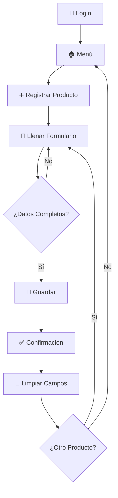
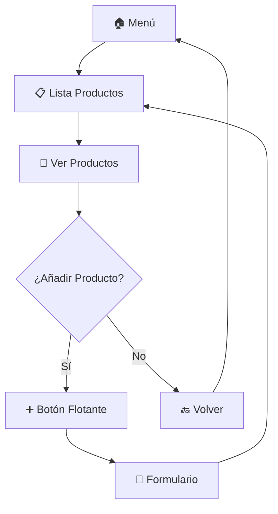
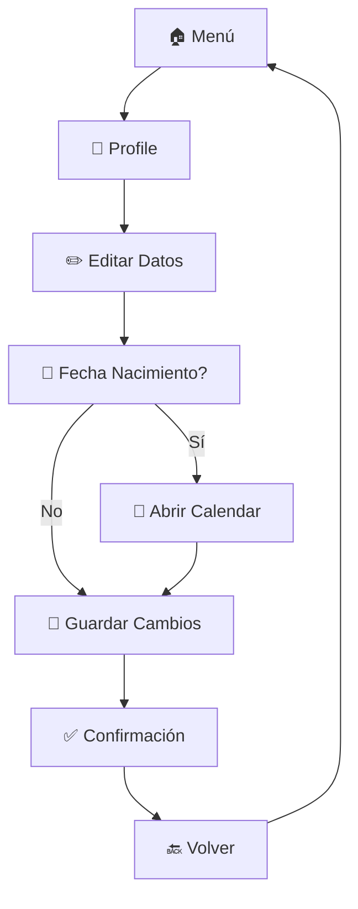

# 📱 Guía de Usuario - Tienda Móvil

## 📋 Tabla de Contenidos
- [Introducción](#-introducción)
- [Primeros Pasos](#-primeros-pasos)  
- [Pantallas de la Aplicación](#-pantallas-de-la-aplicación)
- [Flujos de Trabajo](#-flujos-de-trabajo)
- [Consejos y Trucos](#-consejos-y-trucos)
- [Solución de Problemas](#-solución-de-problemas)
- [Preguntas Frecuentes](#-preguntas-frecuentes)

## 🎯 Introducción

**Tienda Móvil** es una aplicación intuitiva diseñada para ayudar a pequeños comerciantes a gestionar su inventario de productos de manera eficiente y profesional.

### ✨ ¿Qué puedes hacer con Tienda Móvil?

- 🔐 **Autenticarte** de forma segura en la aplicación
- ➕ **Registrar productos** con información detallada
- 📋 **Ver y gestionar** tu inventario completo
- 👤 **Administrar tu perfil** personal
- 🧭 **Navegar fácilmente** entre diferentes secciones

## 🚀 Primeros Pasos

### 1. 📲 Instalación

La aplicación está disponible para múltiples plataformas:

- **Android**: Descargar APK o desde Google Play Store
- **iOS**: Descargar desde App Store  
- **Web**: Acceder desde tu navegador
- **Desktop**: Versión para Windows, macOS y Linux

### 2. 🔑 Primer Acceso

Al abrir la aplicación por primera vez, verás la **pantalla de Login**:

```
┌─────────────────────────┐
│        LOGIN            │
│                         │
│ Email: ________________ │
│                         │
│ Password: _____________ │
│                         │
│      [  LOGIN  ]        │
└─────────────────────────┘
```

> **Nota**: En esta versión, puedes usar cualquier email y contraseña para acceder. La validación real se implementará en futuras versiones.

## 📱 Pantallas de la Aplicación

### 🔐 1. Pantalla de Login

**Propósito**: Punto de entrada seguro a la aplicación.

#### 📝 Campos Disponibles:
| Campo | Descripción | Ejemplo |
|-------|-------------|---------|
| **Email** | Tu dirección de correo | usuario@ejemplo.com |
| **Password** | Tu contraseña segura | ••••••••• |

#### 🎯 Acciones:
- **LOGIN**: Ingresar a la aplicación
- **Validación visual**: Los campos se destacan al enfocar

#### 💡 Tips:
- Asegúrate de tener conexión a internet
- Los datos no se validan actualmente (versión demo)

---

### 🏠 2. Menú Principal

**Propósito**: Hub central de navegación hacia todas las funcionalidades.

```
┌─────────────────────────┐
│         MENU            │
│                         │
│ [ Home ]                │
│ [ Profile ]             │  
│ [ Registrar Producto ]  │
│ [ Lista de Productos ]  │
│ [ Settings ]            │
│                         │
│ [ Logout ]              │
└─────────────────────────┘
```

#### 🎯 Opciones Disponibles:

| Opción | Acción | Descripción |
|--------|--------|-------------|
| **Home** | Información | Pantalla principal (próximamente) |
| **Profile** | Navegar | Ir a tu perfil personal |
| **Registrar Producto** | Navegar | Añadir nuevo producto |
| **Lista de Productos** | Navegar | Ver inventario completo |
| **Settings** | Información | Configuraciones (próximamente) |
| **Logout** | Salir | Cerrar sesión y volver al login |

#### 💡 Tips:
- El menú es tu punto de partida para todas las tareas
- Usa **Logout** para cambiar de usuario

---

### ➕ 3. Registro de Productos

**Propósito**: Añadir nuevos productos a tu inventario con información completa.

#### 📋 Formulario Completo (5 Campos):

```
┌─────────────────────────────────┐
│     REGISTRO DE PRODUCTOS       │
│                                 │
│ Nombre del producto:            │
│ _____________________________ │
│                                 │  
│ Precio:                         │
│ _____________________________ │
│                                 │
│ Descripción:                    │
│ _____________________________ │
│ _____________________________ │
│ _____________________________ │
│                                 │
│ Categoría:                      │
│ _____________________________ │
│                                 │
│ Stock:                          │
│ _____________________________ │
│                                 │
│        [ GUARDAR ]              │
└─────────────────────────────────┘
```

#### 📝 Detalle de Campos:

| # | Campo | Tipo | Obligatorio | Descripción | Ejemplo |
|---|-------|------|-------------|-------------|---------|
| 1️⃣ | **Nombre del producto** | Texto | ✅ | Nombre identificativo | "iPhone 13 Pro" |
| 2️⃣ | **Precio** | Numérico | ✅ | Precio en moneda local | "1299.99" |
| 3️⃣ | **Descripción** | Texto multilínea | ❌ | Descripción detallada | "Smartphone última generación..." |
| 4️⃣ | **Categoría** | Texto | ✅ | Clasificación | "Electrónicos" |
| 5️⃣ | **Stock** | Numérico | ✅ | Cantidad disponible | "25" |

#### 🎯 Funcionalidades:
- **Auto-scroll**: La pantalla se ajusta automáticamente
- **Validación de tipos**: Campos numéricos solo aceptan números
- **Limpieza automática**: Los campos se limpian tras guardar
- **Feedback visual**: Confirmación al guardar producto

#### 💡 Tips de Uso:
- Completa todos los campos obligatorios
- Usa descripciones claras para mejor organización
- El stock te ayudará a controlar el inventario

---

### 📋 4. Lista de Productos

**Propósito**: Visualizar y gestionar todo tu inventario de productos.

#### 🎨 Diseño de la Lista:

```
┌─────────────────────────────────┐
│            Items                │
│                                 │
│ ┌─────────────────────────────┐ │
│ │ Producto 1        $25.99    │ │
│ │ Descripción del producto 1  │ │  
│ │ Categoría: Categoría A      │ │
│ └─────────────────────────────┘ │
│                                 │
│ ┌─────────────────────────────┐ │
│ │ Producto 2        $45.50    │ │
│ │ Descripción del producto 2  │ │
│ │ Categoría: Categoría B      │ │
│ └─────────────────────────────┘ │
│                                 │
│                            [+]  │
└─────────────────────────────────┘
```

#### 📊 Información Mostrada:

| Elemento | Descripción |
|----------|-------------|
| **Nombre** | Título del producto en **negrita** |
| **Precio** | Valor en color azul destacado |
| **Descripción** | Texto descriptivo en gris |
| **Categoría** | Clasificación en texto pequeño |

#### 🎯 Interacciones:
- **Tocar producto**: Ver detalles (muestra mensaje)
- **Botón flotante (+)**: Ir a registro de producto
- **Scroll**: Navegar por lista larga
- **Botón Atrás**: Volver al menú

#### 💡 Tips:
- Los productos se organizan por orden de registro
- Usa el botón + para añadir productos rápidamente
- La lista es infinita - añade tantos productos como necesites

---

### 👤 5. Perfil de Usuario

**Propósito**: Gestionar tu información personal y datos de cuenta.

#### 👨‍💼 Estructura del Perfil:

```
┌─────────────────────────────────┐
│          🙂                     │
│                                 │
│        Mi Perfil                │
│                                 │
│ Nombre:                         │
│ _____________________________ │
│                                 │
│ Apellidos:                      │
│ _____________________________ │
│                                 │
│ Fecha de nacimiento:            │
│ _____________________________ │📅│
│                                 │
│    [ GUARDAR CAMBIOS ]          │
│                                 │
│ ┌─────────────────────────────┐ │
│ │ Información de la cuenta    │ │
│ │ Email: usuario@ejemplo.com  │ │
│ │ Miembro desde: Enero 2024   │ │
│ │ Productos registrados: 12   │ │
│ └─────────────────────────────┘ │
└─────────────────────────────────┘
```

#### 📝 Campos Editables:

| Campo | Tipo | Funcionalidad |
|-------|------|---------------|
| **Nombre** | Texto libre | Editable directamente |
| **Apellidos** | Texto libre | Editable directamente |
| **Fecha de nacimiento** | Selector | Abre calendario interactivo |

#### 🗃️ Información de Solo Lectura:

| Campo | Descripción |
|-------|-------------|
| **Email** | Tu dirección de correo registrada |
| **Miembro desde** | Fecha de registro en la app |
| **Productos registrados** | Contador de productos activos |

#### 📅 Selector de Fecha:
- **Rango**: Desde 1900 hasta hoy
- **Formato**: DD/MM/AAAA
- **Interacción**: Toca el campo para abrir calendario

#### 💡 Tips:
- Los cambios se guardan localmente
- El avatar es un placeholder (personalización futura)
- La información de cuenta se actualizará automáticamente

## 🧩 Widgets y APIs usados por las vistas
- **Navigator**: Rutas nombradas con `Navigator.pushNamed` y `Navigator.pushReplacementNamed` (ej. [lib/screens/login_screen.dart](lib/screens/login_screen.dart), [lib/screens/menu_screen.dart](lib/screens/menu_screen.dart)).
- **ListView.builder**: Listas dinámicas y renderizado eficiente (ej. [lib/screens/product_list_screen.dart](lib/screens/product_list_screen.dart)).
- **TextField & TextEditingController**: Campos de entrada con `obscureText`, `readOnly`, `keyboardType` y `maxLines` (varios screens como [lib/screens/login_screen.dart](lib/screens/login_screen.dart) y [lib/screens/register_product_screen.dart](lib/screens/register_product_screen.dart)).
- **Botones**: `ElevatedButton` para acciones principales y `FloatingActionButton` para añadir productos.
- **Layouts y contenedores**: `Scaffold`, `AppBar`, `SafeArea`, `Padding`, `Column`, `Row`, `Expanded`, `SizedBox`.
- **Interacciones**: `GestureDetector`, `InkWell` y `Material` para respuestas táctiles y efectos visuales.
- **Feedback**: `ScaffoldMessenger.of(context).showSnackBar` para notificaciones breves al usuario.
- **Selector de fecha**: `showDatePicker` para elegir fechas (ej. [lib/screens/profile_screen.dart](lib/screens/profile_screen.dart)).
- **Avatar y iconos**: `CircleAvatar` y `Icon` usados como placeholders visuales.
- **Estilos**: Uso de `Text`, `TextStyle` y `BoxDecoration` para presentación consistente.
- **Buenas prácticas**: Liberar `TextEditingController` en `dispose()` para evitar fugas de memoria.

## 🔄 Flujos de Trabajo

### 📈 Flujo Principal: Registro de Producto



### 📊 Flujo Secundario: Consulta de Inventario



### 👤 Flujo de Gestión de Perfil



## 💡 Consejos y Trucos

### 🚀 Productividad

#### Para Registro Rápido:
1. **Prepara la información**: Ten todos los datos del producto listos
2. **Usa el teclado numérico**: Para campos de precio y stock
3. **Aprovecha la descripción**: Añade detalles que te ayuden después
4. **Categorías consistentes**: Usa las mismas categorías para facilitar organización

#### Para Gestión de Lista:
1. **Revisa regularmente**: Mantén tu inventario actualizado  
2. **Usa el botón +**: Acceso rápido desde la lista
3. **Toca para detalles**: Cada producto muestra información al tocar

#### Para Perfil:
1. **Actualiza datos**: Mantén tu información personal al día
2. **Usa el calendario**: Más fácil que escribir fechas manualmente
3. **Revisa estadísticas**: El contador de productos te ayuda a hacer seguimiento

### 🎨 Personalización

#### Navegación Eficiente:
- **Botón Atrás**: Siempre disponible en pantallas internas
- **Menú Central**: Tu hub para todas las funciones
- **Logout Seguro**: Cambia de usuario fácilmente

## 🔧 Solución de Problemas

### ❗ Problemas Comunes

#### 1. La app no inicia
**Soluciones:**
- Verifica que tengas Flutter instalado correctamente
- Ejecuta `flutter doctor` para revisar configuración
- Reinicia el dispositivo/emulador

#### 2. Los campos no responden
**Soluciones:**
- Toca directamente sobre el área de texto
- Verifica que el teclado esté configurado correctamente
- Reinicia la aplicación

#### 3. La navegación no funciona
**Soluciones:**
- Asegúrate de tocar completamente los botones
- Espera a que las animaciones terminen
- Verifica la conexión si hay problemas de rendimiento

#### 4. Los datos no se guardan
**Soluciones:**
- Completa todos los campos obligatorios
- Toca específicamente el botón "GUARDAR"
- Espera la confirmación visual antes de navegar

### 🔄 Reinicios y Limpieza

#### Para limpiar datos temporales:
1. Cierra completamente la aplicación
2. Reinicia la app
3. Vuelve a hacer login

#### Para reportar problemas:
- Documenta los pasos que causaron el problema
- Toma capturas de pantalla si es posible
- Contacta al equipo de desarrollo

## ❓ Preguntas Frecuentes

### 🔐 Seguridad y Acceso

**P: ¿Necesito crear una cuenta?**  
R: En la versión actual (1.0.0), puedes usar cualquier email y contraseña. La creación de cuentas reales se implementará en la versión 1.1.0.

**P: ¿Mis datos están seguros?**  
R: Actualmente los datos se almacenan localmente. En futuras versiones implementaremos encriptación y almacenamiento en la nube seguro.

**P: ¿Puedo usar la app sin internet?**  
R: Sí, la app funciona completamente offline en la versión actual.

### 📱 Funcionalidades

**P: ¿Cuántos productos puedo registrar?**  
R: No hay límite actual. La aplicación maneja dinámicamente cualquier cantidad de productos.

**P: ¿Puedo editar productos después de crearlos?**  
R: La edición de productos se implementará en la versión 1.1.0. Actualmente solo puedes visualizarlos.

**P: ¿Puedo añadir imágenes a los productos?**  
R: Las imágenes de productos están planificadas para la versión 1.2.0.

**P: ¿Hay búsqueda y filtros?**  
R: La funcionalidad de búsqueda y filtros se añadirá en la versión 1.2.0.

### 🔄 Actualizaciones

**P: ¿Cómo me entero de nuevas versiones?**  
R: Las notificaciones de actualización se implementarán en futuras versiones.

**P: ¿Perderé mis datos al actualizar?**  
R: Implementaremos migración automática de datos para garantizar que no pierdas información.

### 📞 Soporte

**P: ¿Dónde puedo obtener ayuda adicional?**  
R: Puedes contactar al equipo de desarrollo a través de:
- **Email**: soporte@tiendamovil.com  
- **GitHub**: [Repositorio del proyecto](https://github.com/tuusuario/tiendamovil)
- **Documentación**: Revisa los archivos en `/docs`

---

<div align="center">

### 🎉 ¡Listo para comenzar!

**Tienda Móvil te ayuda a gestionar tu inventario de manera profesional y eficiente.**

*¿Necesitas ayuda adicional? Consulta nuestra [documentación técnica](ARCHITECTURE.md) o [guía de instalación](../README.md).*

</div>